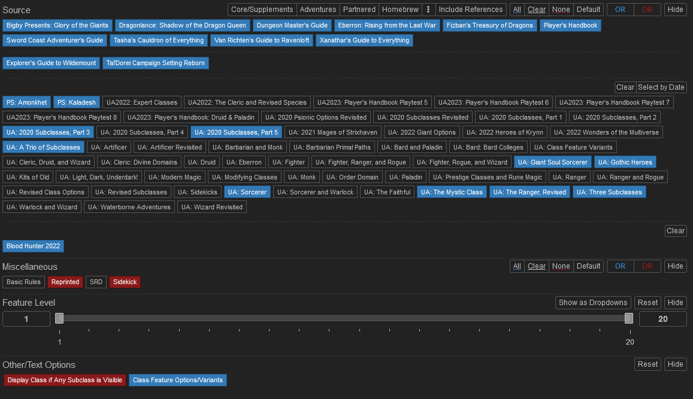
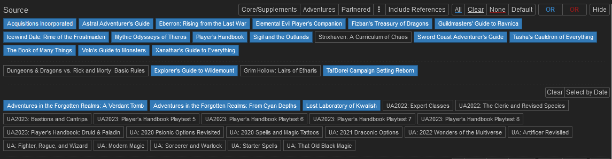
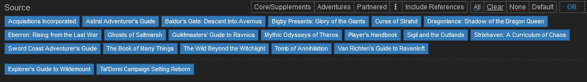
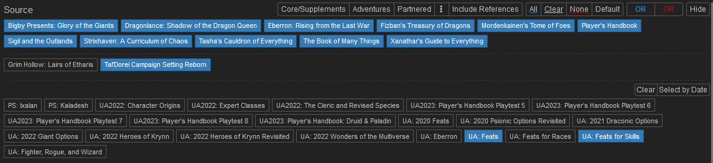

# Getting Started
Below you'll find The Continuation of Ashford's custom rules and guidelines to for creating and developing your character. 

## Sheets and VTT

### Foundry VTT
We use [Foundry virtual tabletop](https://foundryvtt.com)! Please ping the `@Big Mans` or `@Dungeon Masters` roles on Discord to be given a login. 

The Foundry server will automatically shut down after a period of inactivity. If you need it to be turned back on, please ping `@Big Mans` or `@Dungeon Masters` on Discord.

(TBD: Add link publicly here?)

### D&D Beyond
You can create your sheet through D&D Beyond and then import that sheet onto Foundry via button in the UI.

(`TODO`: insert image of the button or video of the process.)

# General Character Creation

Anywhere where you see a "filtered list" of options in a picture below, you can recreate that selection on [5e.tools](https://5e.tools), which is an unofficial D&D 5e resource.

* All characters start from level 3 with standard 27-point buy.
* For HP you can roll or take flat values with one hp re-roll per character.
* Starting player items are as described in the Player’s Handbook and in Tasha's Cauldron of Everything for Artificer (TCE, pg. 9).
* Customizing Your Origin (TCE, pg. 7) is not allowed.

## Notable Changes
* PC stats can go above 20 through either ASIs (Ability Score Improvements) or items.
* The maximum amount of attunement slots is increased to 5.

# Core Character Creation

## Races
To see allowed Races, set the filters according to the image below, or use this [link](https://5e.tools/races.html#flstsource:psz=1~uagothicheroes=1~ttp=1~oga=1~lr=1~awm=1~scc=0,flopsource:extend,sublistselected:%7b%22items%22%3a%5b%5d%2c%22sources%22%3a%5b%5d%7d).


* When creating your character, think about if the race selection fits within the general lore of Forgotten Realms in 5e. If your character's race is from a different IP that does not exist in the Forgotten Realms in 5e, it will not be allowed.
* All UA or earlier official content reprinted in future official books must be updated (i.e. Minotaurs, triton and centaurs from VGM to MOT, Dhampir from UA:GL to VRGR). There are no exceptions.

### Caveats
* If you would like to use Custom Lineage (TCE), approval from `@Big Mans` or `@Dungeon Masters` is required.
* If you are allowed to use a Custom Lineage, you can pick one race for the purposes of racially locked feats and items. This must be recorded in your sheet.

## Classes

To see allowed Classes, set the filters according to the image below, or use this [link](https://5e.tools/classes.htmlflstsource:psa=1~psk=1~ua2020subclassespt3=1~ua2020subclassespt5=1~uaatrioofsubclasses=1~uagiantsoulsorcerer=1~uagothicheroes=1~uasorcerer=1~uathemysticclass=1~uatherangerrevised=1~uathreesubclasses=1,flopsource:extend).



## Spells

To see allowed Spells, set the filters according to the image below, or use this [link](https://5e.tools/spells.html#flstsource:llk=1~scc=0,flopsource:extend,sublistselected:%7b%22items%22%3a%5b%5d%2c%22sources%22%3a%5b%5d%7d).



## Backgrounds

To see allowed Backgrounds, set the filters according to the image below, or use this [link](https://5e.tools/backgrounds.html#flstsource:scc=0,flopsource:extend,sublistselected:%7b%22items%22%3a%5b%5d%2c%22sources%22%3a%5b%5d%7d).



## Feats

To see allowed Feats, set the filters according to the image below, or use this [link](https://5e.tools/feats.html#flstsource:scc=0,flopsource:extend,sublistselected:%7b%22items%22%3a%5b%5d%2c%22sources%22%3a%5b%5d%7d).



## Items

To see allowed items, set the filters according to the image below, or use this [link](https://5e.tools/items.html#flstsource:llk=1~oga=1~scc=0~rmbre=0,flopsource:extend,flsttype:renaissance=0~treasure=0,floptype:extend,flstcategory:specific%20variant=0,flopcategory:extend,sublistselected:%7b%22items%22%3a%5b%7b%22h%22%3a%22breastplate_phb%22%2c%22c%22%3a1%7d%2c%7b%22h%22%3a%22chain%2520mail_phb%22%2c%22c%22%3a1%7d%5d%2c%22sources%22%3a%5b%22phb%22%5d%7d).


We allow items with the Renaissance tag but not the Futuristic tag. There are no exceptions.

# Server Specific

## Nicknames

After creating your character, please change your nickname to show the initial and level and try to keep this updated in one of the following formats.

Single Character:
```
Username (CharacterName lvl)
Username (CharacterInitials lvl)
```
Multiple Characters:
```
Username (CharacterName lvl,CharacterName2 lvl)
Username (CharacterInitials lvl,CharacterInitials2 lvl)
```
For example:
```
@Last_Username (Zhax 5) 
@Firecard (R20,K20,I20,W,D,M,Z)
```

## Character Slots

* You can make an additional character when the highest in your roster hits ***`6`, `9` and `12` level***. 
* After ***`12`th level*** you can make an unlimited number of characters who all start as described in the character creation rules.
* You cannot trade or sell items or gold between your own characters in any way ever.

## Character Background

Once you have created a character, you can optionally put a small background along with a picture in the `#characters` channel on Discord.

## Token Creation

Once you have created your character, you will need to create a token. 

Find your character art and either 
* create a token using [Token Stamp 2](http://rolladvantage.com/tokenstamp/) and pasting a public url (such as imgur) in the token image path of your character's token settings
* or create it directly in the sheet using the "Roll Advantage" icon next to the image path field. (See image below.)


## Reworking

When a character reaches ***`10`th, `15`th, and `20`th level***, it gets a token. These tokens do not have to be spent immediately and can accrue.

You can spend one (`1`) token to change a character's class levels, ability scores, proficiencies, feats, and prestige options as appropriate. (`TODO`: explain more the extent of changes that can be made.)

You cannot change a character's race, background or inventory.

Each token is specific to the character that earned it via leveling. For example, if you create a new character to replace a retired one, they only get a token if they reach the appropriate level naturally. I.e., if you replace a 13 level character, they have no tokens. If that character levels up to 15th level, they will have 1 token.