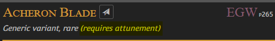

# General Character Creation

Anywhere where you see a "filtered list" of options in a picture on the next page, you can recreate that selection on [5e.tools](https://5e.tools), which is an unofficial D&D 5e resource.

* All characters start from level 3 with standard 27-point buy.
* For HP you can roll or take flat values with one hp re-roll per character.
* Starting player items are as described in the Player’s Handbook and in Tasha's Cauldron of Everything for Artificer (TCE, pg. 9).
* Customizing Your Origin (TCE, pg. 7) is not allowed.

## Notable Changes

* The maximum number of attunement slots is increased from `3` to `5`.
  * *`Tip:` If you don't know, an attunement slot is the equivalent of an "equipment slot" employed by many video games. In D&D 5e, these slots are only used for magic items, but only for some of them. Look for the `(requires attunement)` property underneath the item name*.
  

## [← Index](0_creation_index.md) | [Core Character Creation →](2_core_character_creation.md)
