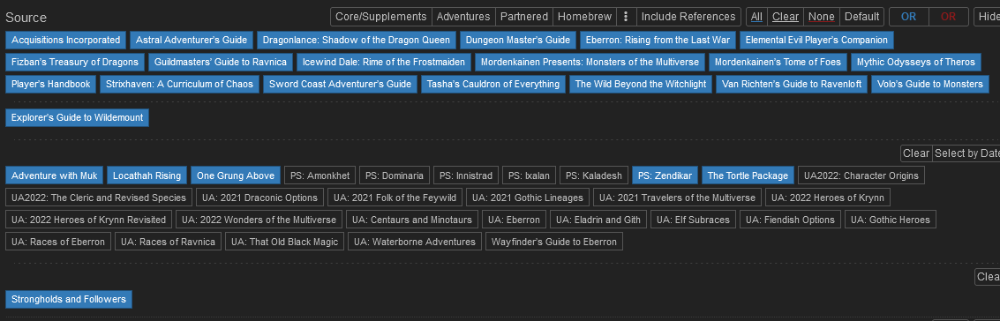
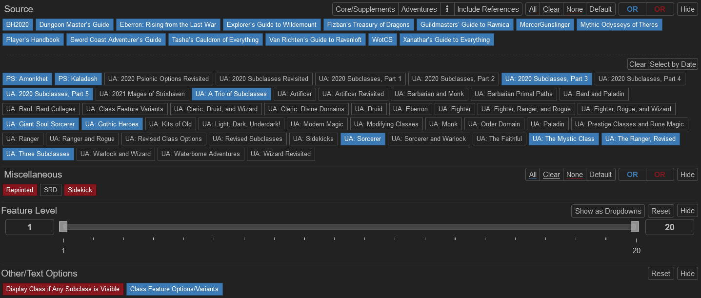
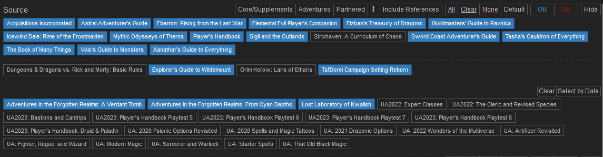
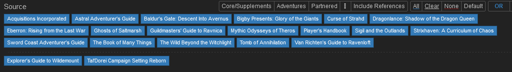
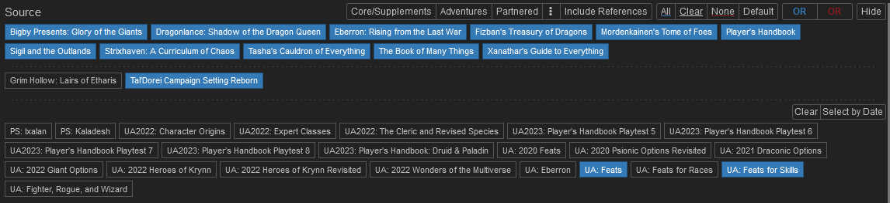
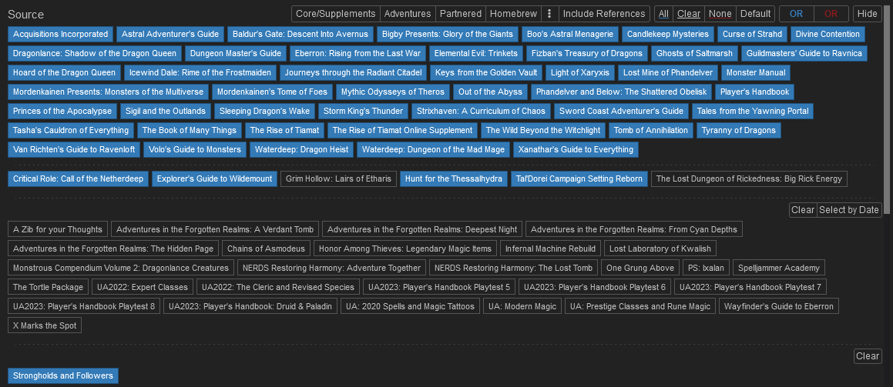

# Core Character Creation
Now that you know where to start (level 3, remember?), let's get into it.

*`Don't forget!` If you've never made a character in D&D 5e before, follow along in the ["Step-by-Step Characters"](https://5etools-mirror-1.github.io/quickreference.html#bookref-quick,0,step-by-step%20characters) section of the Player's Handbook (pg. 11) as you go through each section and make your choices.*

Be aware that ReCoA uses some [custom rules](../modified_mechanics/rules.md). Each section below will contain a link to any relevant rule changes.

(If a link to a filtered 5e page differs from the screenshot of the filter on the github, the screenshot on the github shows the correct options.  Disregard the link, it is most likely outdated.)

## Races
To see allowed Races, set the filters according to the image below, or use this [link](https://5e.tools/races.html#aarakocra_eepc,flstsource:awm=1~lr=1~oga=1~psz=1~ttp=1~uagothicheroes=1,flopsource:extend).

* Note: We also allow the gemstone dragonborn race from Strongholds and Followers.
 
* You are allowed to [Customize Your Origin](https://5e.tools/variantrules.html#customizing%20your%20origin_tce) to change things about your race, because adventurers are often unusual examples of their race.
* When creating your character, think about whether the race selection fits within the general lore of Forgotten Realms in 5e. If your character's race is from a different IP that does not have a connection to existing DnD lore, it will not be allowed.  
* All UA or earlier official content reprinted in future official books must be updated (i.e. Minotaurs, triton and centaurs from `Volo's Guide to Monsters (VGM)` to `Mordenkainen's Tome of Foes (MOT)`, Dhampir from UA:GL to VRGR). There are no exceptions.

*`Remember:` ReCoA uses [some modified Races](../modified_mechanics/races.md).*

### Caveats
* If you would like to use Custom Lineage (TCE), approval from `@Big Mans` or `@Dungeon Masters` is required.
* If you are allowed to use a Custom Lineage, you can pick one race for the purposes of racially locked feats and items. This must be recorded in your sheet.

## Classes

To see allowed Classes, set the filters according to the image below, or use this [link](https://5e.tools/classes.html#artificer_tce,flstsource:psa=1~psk=1~ua2020subclassespt3=1~ua2020subclassespt5=1~uaatrioofsubclasses=1~uagiantsoulsorcerer=1~uagothicheroes=1~uasorcerer=1~uathemysticclass=1~uatherangerrevised=1~uathreesubclasses=1,flopsource:extend).

*`Remember:` ReCoA uses [a few modified class and subclass features](../modified_mechanics/classes.md).*
* Note: We also allow Matt Mercer's Blood Hunter, Way of the Cobalt Soul Monk, and Gunslinger fighters.

## Spells

To see allowed Spells, set the filters according to the image below, or use this [link](https://5e.tools/spells.html#abi-dalzim's%20horrid%20wilting_xge,flstsource:llk=1~scc=0,flopsource:extend).

*`Remember:` ReCoA uses [custom spell economy rules](../modified_mechanics/combat.md#spellcasting-economy) and some [spells have been modfied](../modified_mechanics/spells.md).*

## Backgrounds

To see allowed Backgrounds, set the filters according to the image below, or use this [link](https://5e.tools/backgrounds.html#acolyte_phb,flstsource:scc=0~aag=0,flopsource:extend).

## Feats

To see allowed Feats, set the filters according to the image below, or use this [link](https://5e.tools/feats.html#aberrant%20dragonmark_erlw,flstsource:uafeatsforskills=1~uafeats=1~scc=0,flopsource:extend).

*`Remember:` ReCoA uses [modified feats](../modified_mechanics/feats.md).*

## Items

To see allowed items, set the filters according to the image below, or use this [link](https://5e.tools/items.html#chain%20mail_phb,flstsource:llk=1~oga=1~rmbre=0,flopsource:extend,flsttype:renaissance=0~treasure=0,floptype:extend).

We allow items with the Renaissance tag but not the Futuristic or Modern tag. There are no exceptions.

*`Remember:` ReCoA uses some [custom item mechanics and modified items](../modified_mechanics/items.md).*

## Skills & Proficiencies

*`Remember:` ReCoA uses some [modified skills & proficiencies rules](../modified_mechanics/skills_proficiencies.md).*

## [← General Character Creation](1_general_character_creation.md) | [Index](0_creation_guide.md) | [Finishing Touches →](3_finishing_touches.md)
