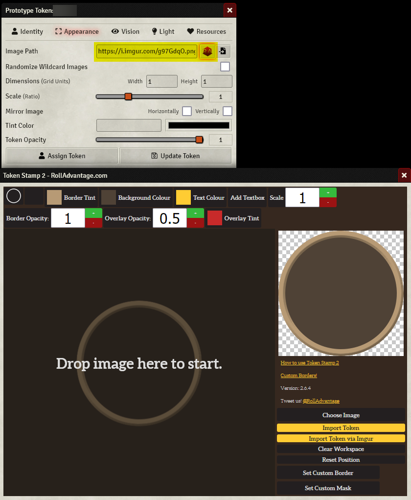

# Finishing Touches
Now that you've got a character, let's complete some finishing touches!

## Nicknames

After creating your character, please change your nickname to show the name or initial and level of your character. 

Try to keep this updated in one of the following formats so everyone know who you are!

Single Character:
```
Username (CharacterName lvl)
Username (CharacterInitials lvl)
```
Multiple Characters:
```
Username (CharacterName lvl,CharacterName2 lvl)
Username (CharacterInitials lvl,CharacterInitials2 lvl)
```
For example:
```
@Last_Username (Zhax 5) 
@Firecard (R20,K20,I20,W,D,M,Z)
```

## Character Background

Once you have created a character, you can optionally put a small background along with a picture in the `#characters` channel on Discord.

## Token Creation

Once you have created your character, you will need to create a token. 

Find your character art and either 
* create a token using [Token Stamp 2](http://rolladvantage.com/tokenstamp/) and pasting a public url (such as imgur) in the token image path of your character's token settings
* or create it directly in the sheet using the "Roll Advantage" icon next to the image path field. (See image below.)



## [← Core Character Creation](2_core_character_creation.md) | [Index](0_creation_guide.md) | [Beyond Level 3 →](4_beyond_level_3.md)