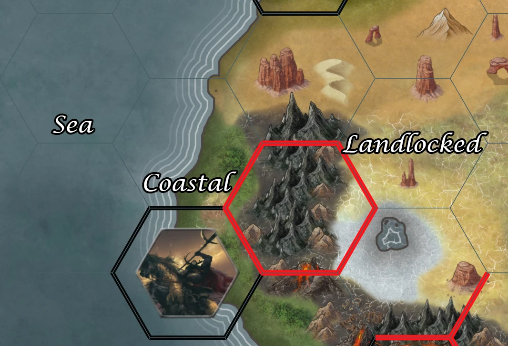
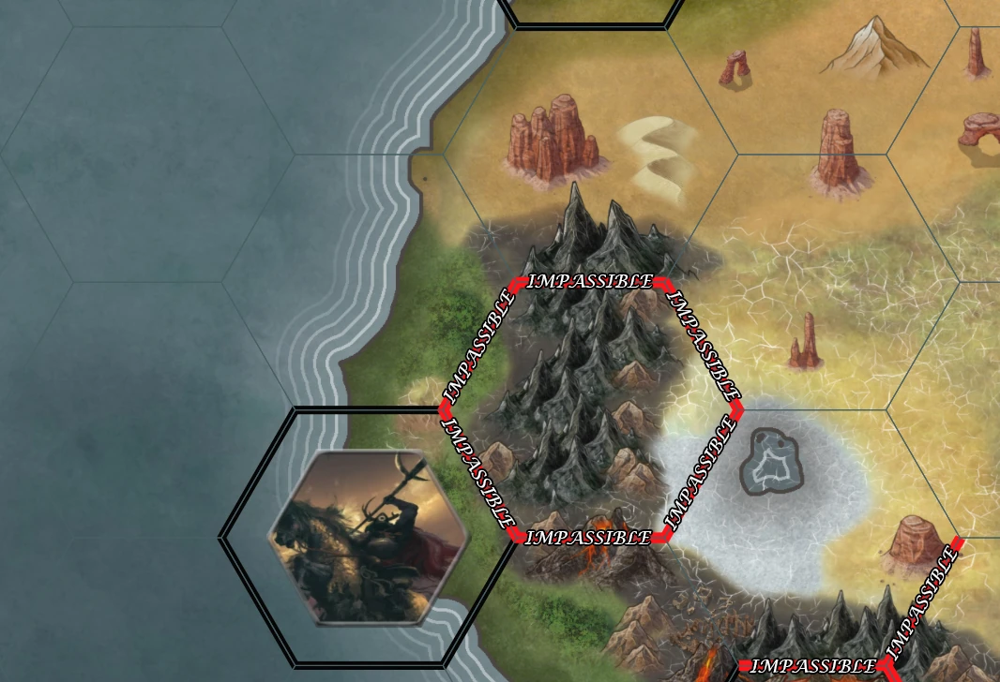
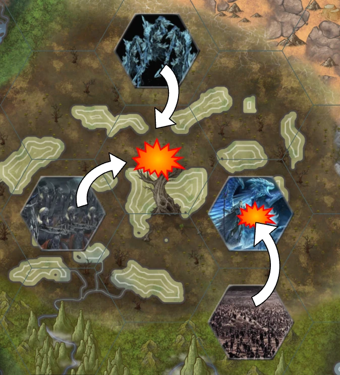
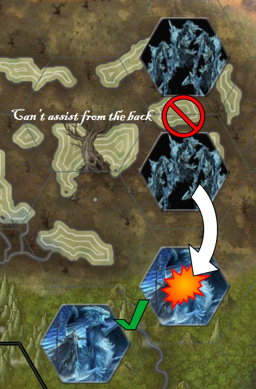
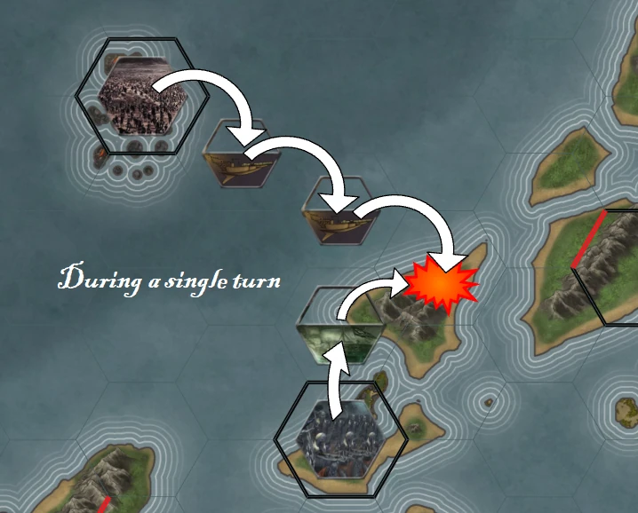

# Kingdoms & Warfare
Settlement and stronghold owners can gain Army Feats, each such feat will give you an army or fleet. Their main purpose is to intercept and ward off enemy factions before they can damage your settlements. Armies allow you to take the fight to the enemy, to block them from reaching your settlements, to have sessions to turn a stalemate into your favor, or even to turn the tables and raid NPC settlements for money.
Using armies to defend your settlements is especially important when settling outposts in the more dangerous higher level areas. 

## Commanding Armies
If you are the controller of a settlement with a standing army feat, your forces can receive orders once per real life week. You write 1 order per army your control in the `warfare-commands` and each Saturday at 6 PM EST the DM will execute the most recent order for each army and fleet.

> The manner in which players control their armies is inspired by the board game Diplomacy. Giving orders and managing armies is very simple, but it is essential to work together with the armies of other players. As the name "Diplomacy" implies, its the communicating and coordinating that makes it a challenge. 

Should the controller of the settlement allow it, they can transfer control of the army or fleet granted by the demesne effect of a Fort Stronghold, to the owner of that fort. But regardless of how many commanders an army has, each army can only execute 1 order per real life week.

### The Map
Armies move on a hex grid, overlayed on Greater Ashford. Each hex is the size of a small kingdom, 200 miles across. There are 3 types of hexes, landlocked hexes, coastal hexes and sea hexes.

Some hexes are intersected by mountains. Mountains in the center of a hex are navigable, only mountains on the border of 2 hexes matter. When 1 edge of a hex is covered by mountains, that edge is impassible. If an edge is impassible due to mountains, the 2 hexes it connects cannot be considered adjacent.

### Giving Orders

There are three orders you can give: **Move/Attack**, **Assist**, or **Ferry**. An army not given an order will hold position.

## Move/Attack
The commander may order each unit they control to move to or attack an adjacent hex. Naturally, armies cannot move into sea hexes, and fleets cannot move into landlocked hexes. 

#### Giving Orders
All Move orders must be written in chat and those decisions are not locked in until `12 PM at ¿timezone?` each saturday. The DM handling the orders locks in what the NPC armies and fleets will do before the players submit any orders (usually NPCs will just Hold & Assist) This is so that the DM can't change what the NPCs do based on the plans for the player armies. But also the DM doesn't reveal what the NPCs are doing to the players until the players have locked in their orders, so the players can't adjust their orders based on what the NPCs will be doing.

There is an exception to this, spying and divination spells during sessions might reveal 1 NPC army's orders early. Allowing players to adapt their orders for that week.

Once all orders are in the discord all movement of armies happens at the same time and all movement of fleets happens at the same time. If an army tries to move into a hex occupied by another army, or if 2 armies try to both move into the same hex, their move order becomes an attack order instead. 

If an army moves into a hex while another army is moving out of it, they don't block each other. If this would cause 2 armies to switch places, player armies can pass through each other peacefully. NPC armies will usually perceive any army marching directly at them as a threat, even if that army just wants to switch places.

Coastal hexes are special, a coastal hex can be occupied by 1 fleet and 1 army at the same time. When an army or fleet moves into an occupied coastal hex, their move order only becomes an attack order if the coastal hex is already occupied by a unit of the same type.

#### Attacking
Each army is theoretically equally matched with every other army. When 2 (or more) equal armies or fleets block each other from moving the attack results in a stalemate, this cancels the movement order of any unit involved and causes them to remain in place.

> Should 2 player armies bump into each other accidentally due to conflicting orders, it is assumed they won't actually fight. The *"attack order"* would consist mostly of yelling obscenities at each other for being in the way.

## Assist
Assist works similar to Readying an Action in D&D. To Assist, your army needs to hold position and choose 1 army to assist. An army can only assist armies that aren't trying to move away from it. So in order to assist a Move/Attack you need to be adjacent to the target of the Attack, you cannot Assist from behind the attacker. Even if multiple separate battles are happening adjacent to a unit, they must choose only 1 target to assist.

Because all armies are equal, a 1v1 is always a stalemate. **The only way to win battles is by using assists tactically.** When an attack happens and the number of assists for each side is not equal only the army with the highest number of assists survives.

> It is possible a 3 way (or more) attack occurs. *Usually due to poor communication and planning.* Either by 3 or more armies all trying to move into the same square, or by 2 or more armies trying to move into an occupied square. If someone was ready to assist, this can cause 1 army to wipe out multiple other armies in a single turn.

#### Fleets
Fleets work similar to armies when Move/Attacking other fleets. Just like armies, if 2 fleets try to move into the same hex, or a fleet tries to move into a hex occupied by another fleet, their move orders become attack orders.   

All fleets are equally matched, so a 1v1 is always a stalemate. The only way to win sea battles is by one fleet being assisted.

#### Coastal Battles
Only when both an army and a fleet occupy the same coastal square, can fleets attack or assist armies or armies attack or assist fleets.

## Ferry
Normally armies cannot move into sea hexes. However a fleet in a sea hex adjacent to a coastal hex  can be ordered to ferry. A ferry order designates a target army that is allowed to move op top of the fleet using a Move/Attack order. The commander of the fleet then chooses 1 hex adjacent to the fleet to deposit the army into, provided that hex is a valid place for the army to be.

A valid place to deposit a ferried fleet can be a coastal hex, or another fleet that is also using the ferry action.

In this way, fleets can be used to move armies across the sea, or to leapfrog armies along a coastline by skipping 1 or more hexes. Allowing armies to be moved surprisingly fast. And this can be often done without the fleets needing to enter the coastal squares where they'd be susceptible to attack by an army.

## Sabotage by Players
When armies or fleets battle and especially when they stalemate, players have the rest of the week before the new orders are executed, to interfere with that stalemate. Successfully completing a quest  by engaging in a notable act of sabotage to weaken the army or fleet will count as an Assist for any unit attacking the sabotaged unit. Thereby changing the outcome of the battle and destroying a unit. 

## Raiding
When an army or fleet is in a hex that contains an outpost or village, that army can be ordered to attack the settlement.

Attacking an unguarded settlement means raiding it. A raid rolls a 1d6 and gains that many downtimes that it will spend on deconstructing buildings. The attacking army can choose which buildings it targets. This causes valuables, goods, equipment and people to be acquired by the raiding army equal to the gold cost of deconstructing those buildings. That army will carry that with them until they deposit them somewhere; players could reclaim that loot from that army.

## Besieging
A town, city, or kingdom requires the "Palisades or Guard post" building. While a settlement has that building it cannot be raided and is a guarded settlement. Such settlements are marked with a black border on their hex. A guarded settlement counts as having 1 army, but that army doesn't occupy a hex and can't leave the settlement. 

When ordered to attack a guarded settlement, armies must instead besiege the settlement. An attacking army will need support to not stalemate vs. the "army" of a guarded settlement. The "army" of a guarded settlement is able to support armies defending against attack while that army is in settlement's hex, but can't otherwise receive orders.

For each order to seige, the attacking army adds 1d6 to a pool of dice, each time this happens the settlement being besieged is asked to surrender to come under new management. While there are dice in the pool, that settlement cannot be traveled to or from, and characters in the settlement cannot spend downtimes to build or repair buildings.

Once that army's controller believes enough dice are in the pool, the time for surrender has passed and they roll the dice pool. The total of the roll is the number of downtimes that the army will spend on the deconstructing a building downtime. The buildings targeted during a seige are chosen randomly, and ignore their gold cost.

The pool of dice for a seige is emptied after it is rolled, or when the attacking army moves off of the hex the settlement is in.

When one of the buildings the seige randomly destroys is the "Palisades or Guard post" building, the seige ends. The next order to the attacking army can be to raid the settlement, or take it over. 

## Standing Army Feat
When a players creates a standing army feat to a settlement the feat should declare wether the resulting unit is an army or a fleet. Only settlements with a port can produce fleets. The feat should also describe what the army is comprised of. 

For example:
> The Goblin Worg Rider Cavalry is an army that contains Goblins, Worgs and a small number of Goblin Chieftains riding Giant Boars.

If a unit is defeated it will need to be reinforced at the settlement that has the feat it came from. A unit who's home settlement was destroyed or captured can continue to receive orders from the settlement owner, but if the unit is defeated it will be dead forever.

#### Reinforcing
Reinforcing an army by default costs 10,000gp and 4 downtimes, to train, recruit, and resupply. However some armies (usually undead) might have a "no survivors" advantage, that doubles the downtime cost of reinforcing units destroyed by it.

#### Improving Units
You might choose to give your unit an extra 50% or extra 100% extra gold and downtime costs to reinforce as the disadvantage of the settlement feat, in order to apply an advantage to the mechanics of the feat's unit.

> A unit created by players can never gain an advantage that allows it to self-assist or otherwise become able to defeat opposing units without needing an Assist. Neither can you double Assist, or twin Assist, or anything like that. But depending on how costly a disadvantage you choose is, advantages you give your Army Feat can change how they interact with some of the mechanics in various other ways. 

For example:
- A unit of clerics that is especially good at buffing might have the ability to "Assist fom the back" if they are adjacent to the hex an attacker moves out of.
- A unit of flying creatures would be able to consider hexes separated by mountainous borders as adjacent. 
- A fleet of submersibles or tamed Giant Sharks might lack the ability to Ferry units, but can be given a Move order to stay submerged on a sea hex, to count as moving out of the hex without actually moving.

Like any other Settlement Feat, you need to contact a DM with your proposed Army feat, that DM will check it against examples to see if it is reasonable and perhaps advise you on how to describe it in a way that is both short and sweet. Once you and the DM agree the Army feat is ready, the DM will tell the other DMs about the feat and add it to the list of used feats so nobody else can make an army of fleet with that name.
