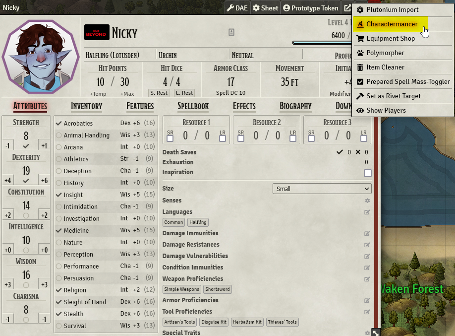
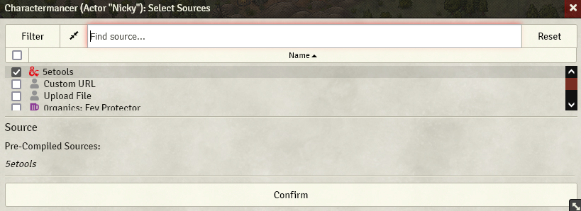
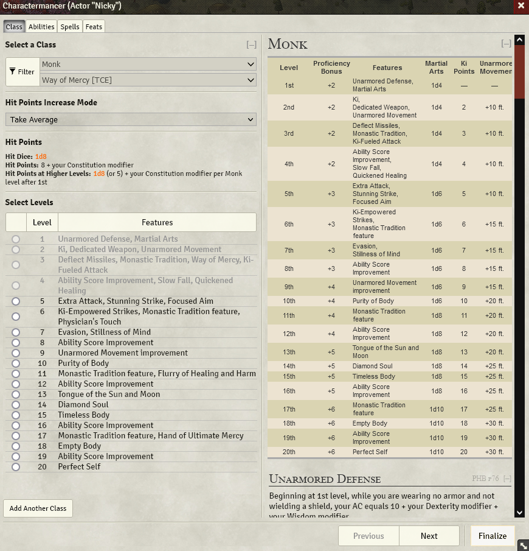
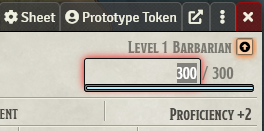
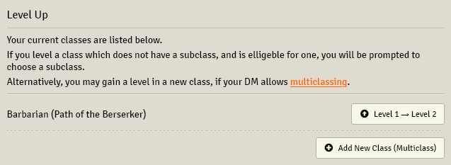
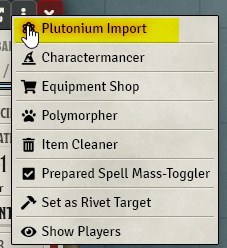
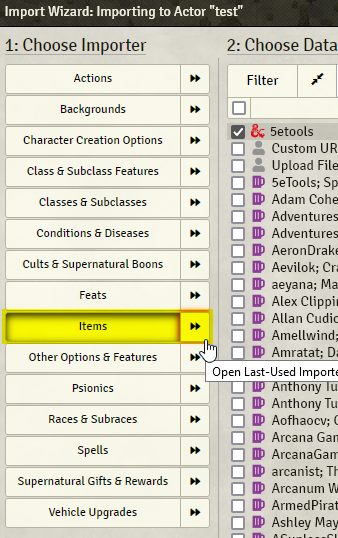
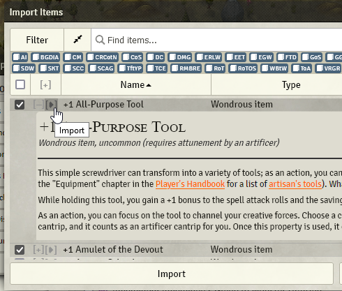

# Charactermancer
5etools publishes two plugins for Foundry: Plutonium and Charactermancer. 

Both use 5etools as a data source to help create, level, and update your character sheet right from Foundry.
## Creating Your Character Sheet

Follow the steps below to create your character in the 5etools Charactermancer.

1. Open your character sheet in Foundry.
2. Click on `...` icon to the right of the `x` to close the sheet.
3. Select the `Charactermancer` option from the dropdown.
   
   

4. Choose `5etools` as the source.
   
   

5. The Charactermancer dialogue will walk you through creating a character step by step.

   

## Leveling up

1. Open your character sheet.
2. Add the EXP you gained from your session into the field below your level and class. 
3. When you do so, if your EXP meets or exceeds the amount needed for the next level, the `🠕` button will be flashing orange.
   
   

4. Click the `🠕` button.
5. Follow the prompts to make your level up selections. 
   
   

## Importing Items

1. Open your character sheet.
2. Click on `...` icon to the right of the `x` to close the sheet.
   
   

3. Select the category of thing you want to import such as items, spells, etc. Click on the `>>` button to quick-open the 5etools source. 
   
   

4. Find the items you want to import by searching or scrolling. 
5. Either select the check boxes for each item and then select the large "Import" button at the bottom of the window or click the small `▶` icon to the left of the item name. 
   1. `Tip:` you can expand the item by clicking the `+` icon.
   
   

