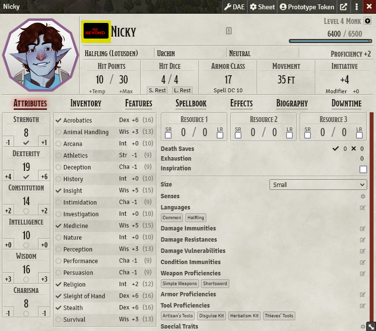
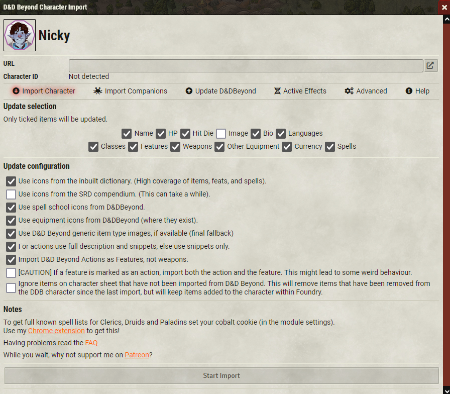

# D&D Beyond

# Creating Your Character Sheet
You're on your own here. Maybe some pure soul will come along and fill in this section.

`TODO:` Find pure soul.

# Importing Your Character

Follow the steps below to import your character from D&D Beyond.

1. Open your character sheet in Foundry.
2. Click on the D&D Beyond button next to your character's name. (highlighted)
   
    
3. Copy and paste the URL of your character sheet from D&D Beyond into the import dialogue. (Make sure your character is set to public!)
4. Make your selections and then "Start Import".
   
    
