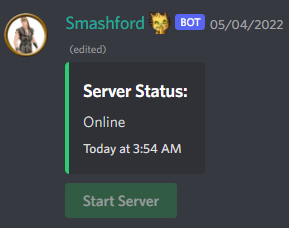

# Foundry VTT
We use [Foundry virtual tabletop](https://foundryvtt.com)! 

Please ping the `@Big Mans` or `@Dungeon Masters` roles on Discord to be given a login. 

The Foundry server will automatically shut down after a period of inactivity. We have a bot which monitors the current status of the Foundry server and allows players to restart it. 

Currently, this is in the `#player-services` channel, though that is subject to change.

The link to our Foundry server can be found here: https://ashford-moltenhosting.moltenhosting.com/join

# Sheets
When it comes to character sheets, you have two options:

1. [5etools](https://5e.tools)
2. [D&D Beyond](https://www.dndbeyond.com)

This guide generally assumes that you will be using option #1 as it's what most of the server uses and doesn't require buying all of the content digitally. ~~Digital access codes with book purchases when, WOTC!?~~

## 5etools Charactermancer 
If you choose to create your sheet through 5etools, then you get to use the wonderful Charactermancer plugin! 

Learn how to populate your sheet in the [Charactermancer Guide](charactermancer.md)

## D&D Beyond Importer
If you choose to create your sheet through D&D Beyond, you'll need to import that sheet onto Foundry via a plugin.

Learn how to populate your sheet in the [D&D Beyond Setup Guide](dndbeyond.md)